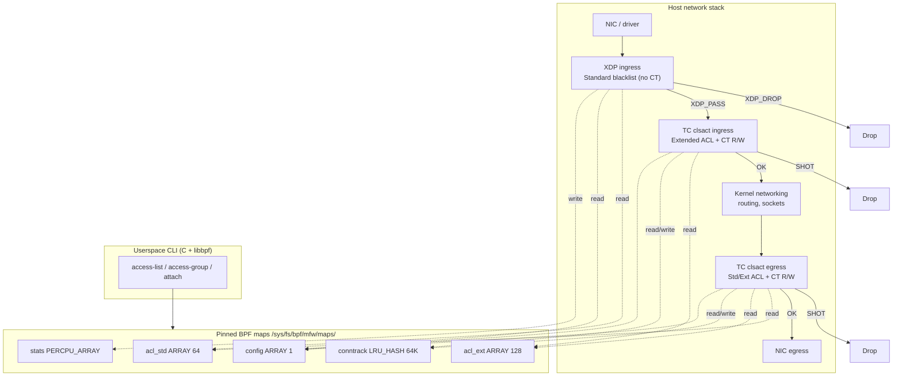
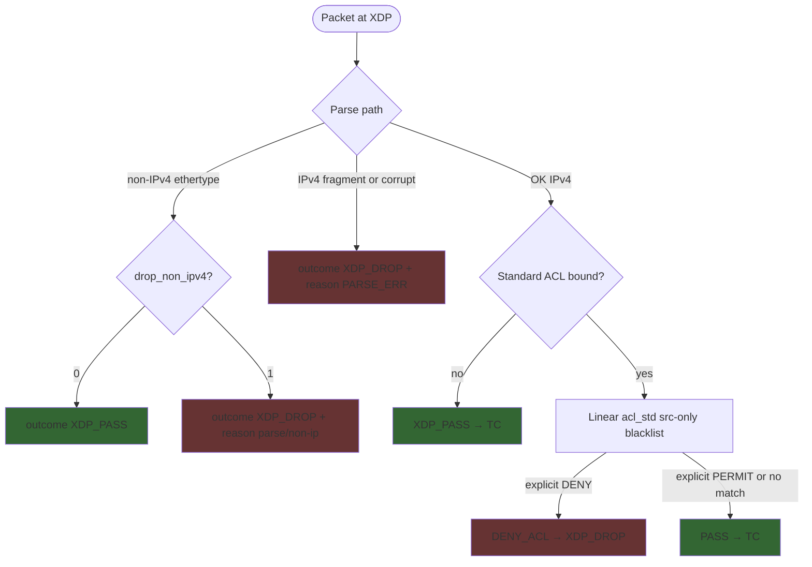
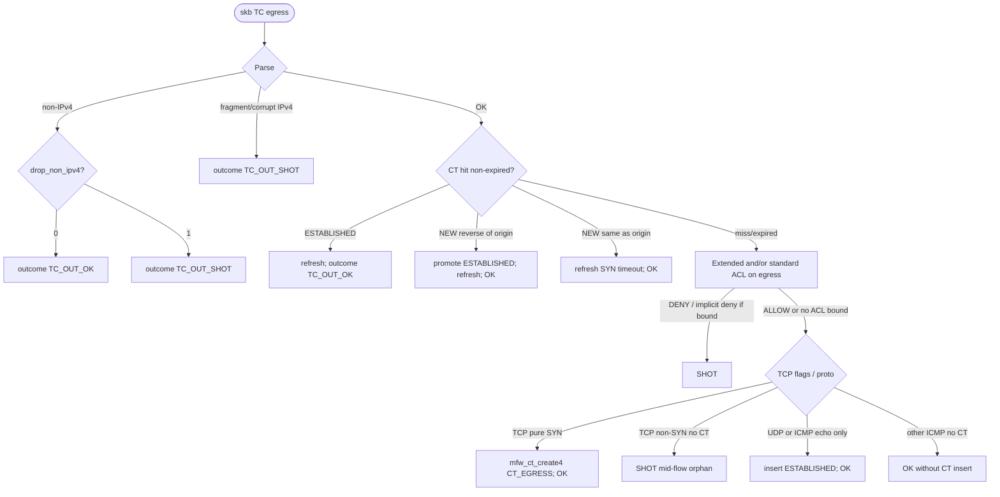
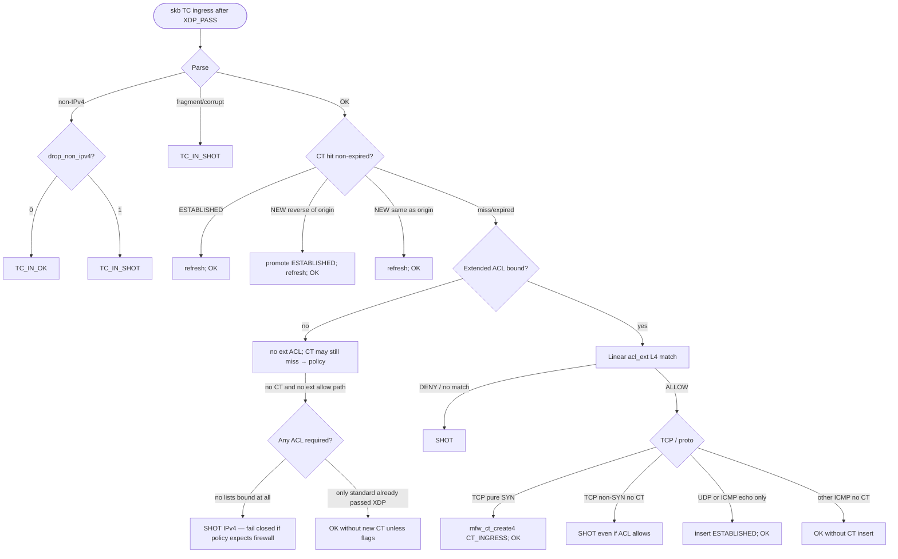
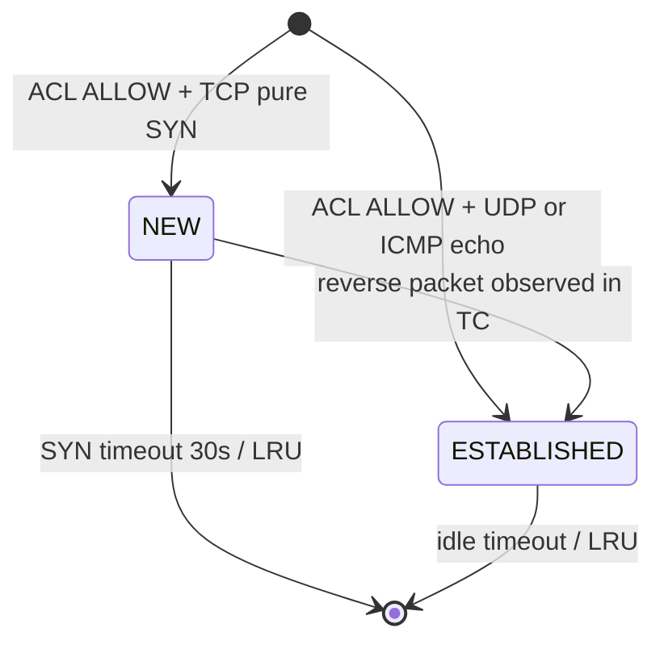

# mini-fw: L4 Mini Firewall based on XDP/TC

| Field | Value |
|-------|--------|
| **Document** | Design Specification |
| **Project** | mini-fw |
| **Author** | Design Doc Writer |
| **Date** | 2026-08-09 |
| **Status** | Draft (Rev 11 — XDP standard = blacklist (no implicit deny, no XDP CT)) |
| **Audience** | Senior engineers implementing the dataplane and control plane |
| **Target OS** | Linux 5.10+ (BTF + libbpf ≥ 0.7 preferred) |

---

## Overview

**mini-fw** is an educational / operational IPv4 L4 firewall implemented with eBPF. Policy is **Cisco-style numbered access lists** (sequential ACEs, first-match-wins). **Semantics differ by list type:** extended (100–199) keeps classic **implicit deny** at end when bound; **standard (1–99) on XDP is blacklist-only — never implicit deny** (miss → PASS).

**CLI binary is `mfw`**. ACL syntax **copies Cisco IOS** (with `ip` prefix as on modern IOS):

```text
mfw ip access-list 10 deny host 192.168.1.10
mfw ip access-list 10 permit 192.168.1.0 0.0.0.255
mfw attach -i eth0
mfw ip access-group 10 in eth0
mfw show ip access-lists
```

Classic numbered form without `ip` is accepted as an alias (older IOS style):
`mfw access-list 10 deny host 192.168.1.10` ≡ `mfw ip access-list 10 deny host 192.168.1.10`.

All shared UAPI / BPF structs use the **`mfw_` prefix** (`mfw_rule`, `mfw_ct_tuple`, `mfw_ct_entry`, `mfw_config`, …) — same stem as the CLI binary. No daemon; pins under `/sys/fs/bpf/mfw/`.

### Hook placement (normative)

| ACL type | Lists | Match fields | **Where it runs** | Why |
|----------|-------|--------------|-------------------|-----|
| **Standard** | **1–99** | Source IP only | **XDP ingress** (primary); TC egress if `out` | **Blacklist:** `deny host X` → early DROP; miss → PASS |
| **Extended** | **100–199** | Proto + src + dst + ports | **TC only** (clsact ingress + egress) | L4 parse + CT live together; richer match after XDP; full skb in TC |

```text
                    Standard ACL (1–99) BLACKLIST      Extended ACL (100–199) + CT
  NIC ──► XDP ─────────────────────────────────► TC in ──────────────────────► stack
            │ explicit DENY → DROP                 │ permit/deny + implicit deny
            │ miss / permit → PASS                 │ CT create / refresh (writes)
            │ NO conntrack on XDP                  │
            └──────────────────────────────────────┴── TC out (ext ACL + CT) ──► NIC
```

**Ingress pipeline:**
1. **XDP** — **standard ACL blacklist only** (if bound): explicit `deny` → `XDP_DROP`; no match or `permit` → `XDP_PASS`. **No implicit deny. No CT on XDP.** Fragments still dropped; non-IPv4 policy unchanged.
2. **TC ingress** — extended ACL (if bound, **implicit deny** on miss) + **CT lookup/create** (Cilium-inspired). Return path for one-direction permits is handled **here**, not on XDP.

**Egress pipeline:**
1. **TC egress** — extended ACL (implicit deny if bound) and optional standard blacklist; **CT lookup/create**.

**Why no XDP CT:** With standard lists as pure blacklist, return traffic is not killed by an empty/miss standard ACL. Stateful allow lives next to extended policy on **TC** only — simpler XDP, smaller verifier surface.

Non-IPv4: **PASS** unless `drop_non_ipv4`. Fragments: always drop.

---

## Background & Motivation

### Why this project exists

Kernel firewalling today is dominated by nftables/iptables + conntrack, which is powerful but heavy for teaching XDP/TC boundaries and for ultra-early drop of unwanted traffic. mini-fw demonstrates a clear, implementable split:

1. **XDP + standard blacklist** — earliest drop for explicit source denials only (no implicit deny, no CT).
2. **TC + extended ACL + Cilium-style CT** — L4 policy and connection tracking co-located.
3. **Cisco CLI** — `mfw ip access-list` / `ip access-group`.

### Current state

Greenfield. Empty repository at `/home/ubuntu/mini-fw`. No prior code, maps, or loaders.

### Pain points this design addresses

| Pain | Approach |
|------|----------|
| Unwanted hosts burn CPU deep in the stack | **Standard ACL @ XDP** → early `XDP_DROP` |
| L4 policy + return path need skb + state | **Extended ACL + CT @ TC** |
| Putting full L4 ACL / CT in XDP bloats early path | Extended + CT stay in TC; XDP stays source **blacklist** only |
| Stateless extended ACL breaks return path | **CT on TC only**; XDP blacklist never blackholes replies by implicit deny |
| Opaque demos | Cisco CLI, pins, stats, netns smoke |

---

## Goals & Non-Goals

### Goals (v1)

1. **Standard ACL (1–99) @ XDP — blacklist only**: source match + explicit **deny** → early `XDP_DROP`; **no implicit deny** (miss → PASS). Optional `permit` stops scan and PASSes (Cisco-style ordering).
2. **Extended ACL (100–199) @ TC** — full L4; classic **implicit deny** when list is bound; never evaluated in XDP.
3. First-match-wins by ACE sequence within a list.
4. `mfw ip access-group` binds list → hook (standard→XDP in / TC out; extended→TC).
5. **Conntrack: Cilium-inspired BPF CT on TC only** (create/update/lookup). **No CT in XDP** (not needed with blacklist standard ACL).
6. CLI **`mfw`** + Cisco `ip access-list` syntax; structs **`mfw_*`**; unit tests.

### Non-Goals (v1)

- IPv6, NAT, L7 filtering, GeoIP, reputation feeds
- Hardware XDP offload (optional later)
- Full netfilter-compatible semantics or kernel `bpf_ct_*` / nf_conntrack helpers
- **Full Cilium tree** (no k8s identities, service LB, NodePort, proxy_redirect, DSR, IPv6 CT)
- ICMP error **RELATED** map entries in v1 (Cilium creates related ICMP tuples; we defer — PMTUD may blackhole)
- VLAN / QinQ parsing (tagged IPv4 is not filtered)
- Multi-host orchestration, central policy distribution
- Userspace proxying / userspace packet path
- Rate limiting, QoS, logging of every packet to userspace
- Concurrent multi-writer rule updates (single admin CLI assumption)
- Persistent rule store beyond pinned maps (no on-disk config file required for v1; optional later)
- Classic `tc filter add` attach path (emergency detach shell only; see Attach)

### v1 frozen constants

| Constant | Value | Notes |
|----------|-------|-------|
| `MFW_MAX_STD_ACES` | **64** | Standard ACEs in XDP map (source-only loop) |
| `MFW_MAX_EXT_ACES` | **128** | Extended ACEs in TC map (L4 loop) |
| `MFW_CT_MAX_ENTRIES` | **65536** | `BPF_MAP_TYPE_LRU_HASH` |
| Standard end-of-list | **PASS** | Blacklist; no implicit deny |
| Extended end-of-list | **DENY** | Classic implicit deny when bound |
| `drop_non_ipv4` default | **0** (pass) | Read by **XDP + TC in + TC out**; strict drops non-IPv4 everywhere |
| CT model | **Cilium-inspired slim** | See `bpf/lib/ct.h` (attributed); RELATED deferred |
| RELATED / ICMP errors | **out of scope v1** | Cilium `TUPLE_F_RELATED` reserved for later |
| VLAN peel | **none** | `h_proto != ETH_P_IP` → non-IPv4 policy |
| IPv4 fragments | **always drop** | After ihl check; MF or offset ≠ 0 |
| Port “any” sentinel | `(min,max) = (0,0)` | Cannot filter TCP/UDP port 0 in v1 |
| libbpf minimum | **0.7+** | TC opts + bpf_link; test with distro package on 5.10 |
| `__TARGET_ARCH_*` | build-time | Makefile defaults x86; README documents aarch64 etc. |

---

## Key Decisions

| # | Decision | Rationale |
|---|----------|-----------|
| K1 | **Hybrid dataplane: XDP ingress + TC clsact ingress/egress** | XDP for early source drop; TC for L4 + egress + CT. |
| K2 | **CT only on TC (create + lookup + timeout); no CT on XDP** | CT co-located with extended ACL; XDP blacklist does not need REPLY exception. |
| K3 | **XDP standard ACL = blacklist: explicit deny only; miss → PASS** | Never implicit deny on standard@XDP. Simplest early-drop model; return traffic reaches TC CT. |
| K18 | **Borrow CT design from Cilium (slim, attributed subset)** | Proven eBPF CT: tuple + `TUPLE_F_IN/OUT`, reverse/forward lookup, lifetime, TCP flags. Types renamed to **`mfw_ct_tuple` / `mfw_ct_entry`**. SPDX + Authors of Cilium. |
| K19 | **CLI binary is `mfw`** (not `mf` / not `mini-fw`) | Clearer short name for mini-fw; commands: `mfw ip access-list …`. |
| K20 | **All shared structs/macros use `mfw_` / `MFW_`** | Same stem as CLI: `mfw_rule`, `mfw_ct_tuple`, `MFW_MAX_STD_ACES`. Clearer than `mf_` / `MF_`. |
| K4 | **XDP does not run extended ACL or CT; TC owns both** | Clear split: standard blacklist@XDP, extended+CT@TC. |
| K5 | **Standard ACL (1–99) evaluated only in XDP (ingress) and TC egress if bound out** | Source-only matches are ideal for XDP early drop. |
| K15 | **Extended ACL (100–199) evaluated only in TC (in + out)** | L4 fields + CT + bidirectional policy belong on TC hooks; keeps XDP tiny. |
| K16 | **Separate maps: `acl_std` (XDP) and `acl_ext` (TC)** | Smaller verifier loops; cannot accidentally run extended ACEs in XDP. |
| K17 | **Implicit deny: extended lists only (when bound). Standard lists never implicit-deny** | Standard miss = PASS (blacklist). Extended miss = DENY if access-group applied. Unbound hook = open (fail-open). |
| K6 | **Cilium tuple model as `mfw_ct_tuple` (not min/max IP key)** | Key = `mfw_ct_tuple` with reversed addrs for forward layout + `flags` (`TUPLE_F_OUT` / `TUPLE_F_IN`). Reply = reverse lookup. |
| K7 | **LRU_HASH CT map(s); optional split TCP vs any like Cilium** | v1 default: one IPv4 map 64K; optional later `ct4_tcp` + `ct4_any` (Cilium global pattern). |
| K8 | **No daemon; pin under `/sys/fs/bpf/mfw/`** | `mfw attach` / `mfw detach`; maps survive process exit. Requires bpffs. |
| K9 | **IPv4 only; no IPv6 dual-path in v1** | Cuts parse surface and map key size; explicit non-goal. |
| K10 | **Default policy fixed DENY in BPF; `config.default_action` reserved** | Product requirement. CLI `set-default deny` is no-op success; `set-default allow` rejected in v1 (exit 4). Field kept for ABI. `drop_non_ipv4` is honored by **XDP and both TC hooks** (strict mode is global, not XDP-only). |
| K11 | **Cilium CT status on TC: CT_NEW / CT_ESTABLISHED / CT_REPLY; create after extended allow** | Return path allowed at TC via CT_REPLY without reverse ACE; XDP does not participate. |
| K12 | **C + libbpf ≥ 0.7 (not BCC/Go)** | Product constraint; portable CO-RE with BTF where available; `SEC("tc/ingress")` / `SEC("tc/egress")`. |
| K13 | **No RELATED in v1** | Avoid verifier-heavy ICMP error + inner-header parse; document PMTUD risk. |
| K14 | **Shared maps across ifaces; CT key without ifindex; multi-NIC asymmetric routing unsupported** | Single-host mini; attach all on-path ifaces or use one. Do not populate unused ifindex for matching. |

---

## Proposed Design

### High-level architecture



**Single object load (normative):** One `bpf_object` contains XDP + both TC programs and all maps. Shared `conntrack` + split ACL maps. Do **not** load XDP/TC from separate objects without pin reuse.

### Component responsibilities

| Component | Path | Role |
|-----------|------|------|
| `mfw_xdp` | XDP | Parse Eth/IPv4; **standard blacklist** (explicit deny→DROP, else PASS); **no CT**; **never** extended ACL |
| `mfw_tc_ingress` | TC clsact in | **Extended ACL** (implicit deny if bound) + CT R/W |
| `mfw_tc_egress` | TC clsact out | **Extended** + optional standard blacklist + CT R/W |
| CLI loader | userspace | Attach; compile ACEs into `acl_std` / `acl_ext` by list number |

### Packet decision flows

#### XDP ingress



**XDP has no CT map access.** Early drop is only for explicit standard **deny** ACEs (and bad parse/fragments).

#### TC egress



**Egress ACL order (when both bound):** Evaluate **extended first** (more specific L4), then **standard** (source); first explicit match wins across the concatenated active set *or* evaluate extended-only if only 100–199 bound. v1 recommendation: **one list per direction** (either standard *or* extended out) to avoid confusion; if both, extended then standard, then implicit deny if either was bound.

#### TC ingress



**Unbound hooks are fail-open** (no access-group → pass that stage). **Standard bound → blacklist only.** **Extended bound → implicit deny.** Optional later: `mfw attach --strict` for fail-closed unbound TC.

**Inbound L4 NEW sessions:** Extended ingress ACL on **TC** → `mfw_ct_create4(..., CT_INGRESS)`. Return SYN-ACK uses reverse-tuple **CT_REPLY** (Cilium), no reverse ACE.

**Outbound NEW sessions:** Extended egress ACL on **TC** → `mfw_ct_create4(..., CT_EGRESS)`; return on XDP via CT_REPLY read.

### Normative packet acceptance matrix

Legend: Cilium **ct_status** from `mfw_ct_lookup4` (SCOPE_BIDIR). TCP flags: S=SYN, A=ACK, R=RST (pure SYN = SYN without ACK).

| Proto | CT state | Dir | TCP flags / notes | XDP | TC (in or out) | CT mutation (TC only) |
|-------|----------|-----|-------------------|-----|----------------|------------------------|
| any | miss | — | — | ACL | ACL | — |
| any | expired | — | treat as miss; TC deletes | ACL | ACL | delete on TC lookup |
| TCP | NEW | same | any | ACL (no CT short-circuit) | OK + refresh (keep SYN timeout) | update last_seen, pkts, bytes |
| TCP | NEW | rev | SYN-ACK or ACK | **PASS** (CT_ALLOW) | **OK** | → ESTABLISHED; timeout=TCP_EST; refresh |
| TCP | NEW | rev | other | **PASS** (CT_ALLOW) | **OK** | promote ESTABLISHED (handshake-adjacent) |
| TCP | ESTABLISHED | either | any except policy below | PASS | OK | refresh; RST → timeout_sec=30 (short) optional |
| TCP | miss | — | pure SYN | ACL | ACL; if ALLOW → insert NEW | insert BPF_NOEXIST |
| TCP | miss | — | non-SYN | ACL; if ALLOW still… | **SHOT** (no orphan mid-flow) | none |
| UDP | ESTABLISHED | either | — | PASS | OK | refresh |
| UDP | miss | — | first pkt | ACL | ALLOW → insert ESTABLISHED | insert |
| ICMP echo (type 8/0) | ESTABLISHED | either | req or reply; **same CT key** (see ICMP normalize) | PASS | OK | refresh |
| ICMP echo (type 8/0) | miss | — | request or reply | ACL | ALLOW → insert ESTABLISHED | insert |
| ICMP error | — | — | type 3/11/etc. | **ACL only** (no RELATED) | **ACL only**; **no CT insert** | none in v1 |
| ICMP other | — | — | timestamp, etc. | **ACL only** (proto match; ports ignored) | **ACL only**; **no CT insert** | none in v1 |
| IPv4 frag | — | — | MF or offset≠0 | DROP | SHOT | none |
| non-IPv4 | — | — | ethertype ≠ IPv4 | PASS if !drop_non_ipv4 else DROP | **same flag**: OK if !drop_non_ipv4 else SHOT | none |

**Open Question #3 resolved:** Inbound (and egress) TCP non-SYN without CT → **SHOT** even if ACL would allow. Forces proper SYN-created state.

**Expired reverse traffic:** After timeout/LRU eviction, reverse packets fall through to ACL and typically **default-deny** until a new ACL-allowed packet recreates CT. This is correct fail-closed behavior.

### Shared header (UAPI / BPF)

Path: `bpf/mfw.h` (included by BPF) and mirrored as `include/mfw_uapi.h` for userspace.

```c
/* mfw.h / mfw_uapi.h — shared between BPF and userspace (packed, fixed width) */
#ifndef MFW_H
#define MFW_H

#include <linux/types.h>

#define MFW_MAX_STD_ACES    64     /* XDP standard ACL map */
#define MFW_MAX_EXT_ACES    128    /* TC extended ACL map */
#define MFW_CT_MAX_ENTRIES  65536
#define MFW_PIN_PATH        "/sys/fs/bpf/mfw"
#define MFW_ABI_VERSION     1

/* Rule action */
enum mfw_action {
    MFW_ACTION_DENY  = 0,
    MFW_ACTION_ALLOW = 1,
};

/* Direction flags (bitmask) — ACL access-group only */
enum mfw_dir {
    MFW_DIR_INGRESS = 1 << 0,  /* in  */
    MFW_DIR_EGRESS  = 1 << 1,  /* out */
    MFW_DIR_BOTH    = MFW_DIR_INGRESS | MFW_DIR_EGRESS,
};

/* L4 proto filter: 0 = any */
enum mfw_proto {
    MFW_PROTO_ANY  = 0,
    MFW_PROTO_ICMP = 1,   /* IPPROTO_ICMP */
    MFW_PROTO_TCP  = 6,
    MFW_PROTO_UDP  = 17,
};

/* ---- Cilium-inspired CT (slim) — see bpf/lib/ct.h ----
 * Derived from Cilium bpf/lib/common.h + conntrack.h (Authors of Cilium).
 * SPDX: GPL-2.0-only OR BSD-2-Clause. Stripped of k8s/NAT/service fields.
 */

/* Tuple direction flags (Cilium) */
#define TUPLE_F_OUT      0  /* forward / egress-created orientation */
#define TUPLE_F_IN       1  /* reverse / ingress-created orientation */
#define TUPLE_F_RELATED  2  /* reserved v1 — ICMP errors later */

enum ct_dir {
    CT_EGRESS  = 0,
    CT_INGRESS = 1,
};

enum ct_status {
    CT_NEW         = 0,
    CT_ESTABLISHED = 1,
    CT_REPLY       = 2,
    CT_RELATED     = 3,  /* reserved v1 */
};

enum ct_scope {
    SCOPE_FORWARD = 0,
    SCOPE_REVERSE = 1,
    SCOPE_BIDIR   = 2,  /* reverse first, then forward (Cilium default for policy) */
};

/* Timeouts (seconds) — Cilium-like roles; absolute mono lifetime stored in entry */
#define CT_SYN_TIMEOUT              60
#define CT_CONNECTION_LIFETIME_TCP  21600  /* 6h established-ish; lab may lower */
#define CT_CONNECTION_LIFETIME_NONTCP 60
#define CT_CLOSE_TIMEOUT            10

/* Lab-friendly overrides allowed via config later; defaults above match educational mini */

struct mfw_cidr {
    __be32 addr;  /* IPv4 network address, big-endian wire order ONLY */
    __u8   prefix; /* 0..32; BPF clamps >32 to skip rule */
    __u8   pad[3];
};

struct mfw_port_range {
    __u16 min;    /* host byte order after bpf_ntohs on packet ports */
    __u16 max;    /* inclusive; (0,0) = any; cannot match real port 0 */
};

/* ACL list kind (userspace validates range; BPF only sees compiled ACEs) */
enum mfw_acl_kind {
    MFW_ACL_STANDARD = 1,  /* lists 1–99: source only; dst/proto/ports ignored */
    MFW_ACL_EXTENDED = 2,  /* lists 100–199: full L4 match */
};

/*
 * One ACE — Cisco "access-list N …" line.
 * Same layout for standard and extended; XDP match ignores dst/proto/ports
 * when kind == MFW_ACL_STANDARD. Maps: acl_std and acl_ext both use mfw_rule.
 */
struct mfw_rule {
    __u16 acl_id;       /* 1–99 standard, 100–199 extended */
    __u16 seq;          /* line order; lower first */
    __u8  action;       /* MFW_ACTION_ALLOW / DENY */
    __u8  proto;        /* 0=any/ip; ignored for standard */
    __u8  direction;    /* MFW_DIR_* from access-group */
    __u8  enabled;
    __u8  kind;         /* MFW_ACL_STANDARD | MFW_ACL_EXTENDED */
    __u8  pad0[3];
    struct mfw_cidr src;
    struct mfw_cidr dst;           /* any for standard */
    struct mfw_port_range sport;   /* any for standard */
    struct mfw_port_range dport;
    __u32 rule_id;      /* stable id for delete */
    __u32 pad1;
};

/*
 * Cilium ipv4_ct_tuple layout, renamed to mfw_ct_tuple:
 *   Address fields reversed for forward-scope storage.
 */
struct mfw_ct_tuple {
    __be32 daddr;
    __be32 saddr;
    __be16 dport;
    __be16 sport;
    __u8   nexthdr;
    __u8   flags;   /* TUPLE_F_OUT / TUPLE_F_IN / TUPLE_F_RELATED */
} __attribute__((packed));

/* Slim Cilium ct_entry → mfw_ct_entry (no NAT/service/proxy/identity) */
struct mfw_ct_entry {
    __u64 packets;
    __u64 bytes;
    __u32 lifetime;       /* mono now + lifetime (Cilium style) */
    __u16 rx_closing:1,
          tx_closing:1,
          seen_non_syn:1,
          reserved:13;
    __u8  tx_flags_seen;
    __u8  rx_flags_seen;
};

struct mfw_config {
    __u8  default_action; /* ABI: always MFW_ACTION_DENY in v1; BPF ignores for decisions */
    __u8  drop_non_ipv4;  /* 0 = pass non-IPv4 (v1 default); 1 = drop/SHOT on XDP + both TC hooks */
    __u8  log_level;      /* reserved */
    __u8  abi_version;    /* MFW_ABI_VERSION */
    __u32 generation;     /* bumped on rule updates; not used for BPF consistency */
};

/* Stats: every packet increments exactly one OUTCOME and at most one REASON */
enum mfw_stat_id {
    /* Outcomes */
    MFW_STAT_XDP_PASS = 0,
    MFW_STAT_XDP_DROP,
    MFW_STAT_TC_IN_OK,
    MFW_STAT_TC_IN_SHOT,
    MFW_STAT_TC_OUT_OK,
    MFW_STAT_TC_OUT_SHOT,
    /* Reasons (XDP) */
    MFW_STAT_XDP_ALLOW_ACL,
    MFW_STAT_XDP_DENY_ACL,
    MFW_STAT_XDP_DEFAULT_DENY, /* reserved; standard blacklist does not use implicit deny */
    MFW_STAT_XDP_CT_ALLOW,
    MFW_STAT_XDP_PARSE_ERR,
    /* Reasons / CT events (TC-oriented; insert/update counted on mutation) */
    MFW_STAT_CT_INSERT,
    MFW_STAT_CT_INSERT_FAIL,
    MFW_STAT_CT_UPDATE,
    MFW_STAT_CT_PROMOTE,
    MFW_STAT_CT_HIT,
    MFW_STAT_CT_MISS,
    MFW_STAT_CT_EXPIRED_DEL,
    MFW_STAT_MAX,
};

struct mfw_stat_value {
    __u64 count;
};

#endif /* MFW_H */
```

### Map inventory

| Pin name | Type | Key | Value | Max | Access |
|----------|------|-----|-------|-----|--------|
| `acl_std` | `ARRAY` | `__u32` | `struct mfw_rule` | **64** | **XDP R**, TC egress R; userspace RW |
| `acl_ext` | `ARRAY` | `__u32` | `struct mfw_rule` | **128** | **TC only** R; userspace RW |
| `conntrack` | `LRU_HASH` | `mfw_ct_tuple` | `mfw_ct_entry` | 65536 | **TC only** RW (Cilium-style); XDP does not use |
| `config` | `ARRAY` | 0 | `mfw_config` | 1 | XDP+TC R; userspace RW |
| `stats` | `PERCPU_ARRAY` | id | `mfw_stat_value` | `MFW_STAT_MAX` | BPF++; userspace sum |

**Pin base:** `/sys/fs/bpf/mfw/` (requires **bpffs** mounted at `/sys/fs/bpf`).

```
/sys/fs/bpf/mfw/
  maps/
    acl_std
    acl_ext
    conntrack
    config
    stats
  link/
    xdp_<ifname>
    tc_ingress_<ifname>
    tc_egress_<ifname>
  meta/
    clsact_<ifname>     # marker file if we created clsact
```

Prefer **bpf_link** pinning for XDP (kernel 5.7+) and libbpf TC attach. Classic `tc filter add` is **not** a supported attach path in v1 (emergency shell detach only).

### Cisco-style ACL model (normative for v1)

This is the **primary product surface**. Flag-style `rule add --src ...` is a thin internal compile path only (optional alias), not the operator docs.

#### Standard vs extended (hook binding)

| | **Standard ACL** | **Extended ACL** |
|--|------------------|------------------|
| List numbers | **1–99** | **100–199** |
| Matches | **Source IP only** | Proto + src + dst + optional ports |
| Classic example | `access-list 10 deny host 192.168.1.10` | `access-list 100 permit tcp any host 10.0.0.5 eq 22` |
| **Dataplane hook** | **XDP ingress** (primary); TC egress if `out` | **TC ingress and/or egress only** |
| Map | `acl_std` | `acl_ext` |
| Struct | `mfw_rule` (kind=STANDARD) | `mfw_rule` (kind=EXTENDED) |
| CLI reject | ports / dst on standard | wrong list range for shape |

#### Address syntax (CLI → compile)

| Cisco form | Meaning | Compiled |
|------------|---------|----------|
| `host 192.168.1.10` | Exact host | `192.168.1.10/32` |
| `192.168.1.0 0.0.0.255` | Network + **wildcard** (inverse mask) | Convert to longest prefix if contiguous; else reject non-contiguous wildcards in v1 |
| `any` | All addresses | `0.0.0.0/0` |
| `192.168.1.0/24` | CIDR (mini-fw extension) | `192.168.1.0/24` |

**Wildcard rule (v1):** Only contiguous wildcards that map to a prefix length 0..32 are accepted (e.g. `0.0.0.255` → `/24`). Non-contiguous (`0.0.1.255`) → CLI error. This keeps BPF matching as simple CIDR (no wildcard bit-logic in XDP).

#### Port syntax (extended only)

| Form | Meaning |
|------|---------|
| (omit) | any |
| `eq 22` | single port |
| `range 1024 65535` | inclusive range |
| `gt N` / `lt N` | compile to range (optional v1 nicety) |

#### End-of-list semantics (normative)

| List type | Bound? | No ACE matches |
|-----------|--------|----------------|
| **Standard (1–99)** | yes | **PASS** (blacklist — **never** implicit deny) |
| **Standard** | no | PASS (open) |
| **Extended (100–199)** | yes | **DENY** (classic Cisco implicit deny) |
| **Extended** | no | PASS / OK (fail-open until configured) |

Optional later: `mfw attach --strict` = extended-style deny on unbound TC hooks.

#### Interface binding (`ip access-group`)

Cisco:

```text
interface eth0
  ip access-group 10 in
  ip access-group 100 out
```

mini-fw (flat CLI; same words):

```text
mfw ip access-group <acl_id> in|out <ifname>
```

| List | Direction | Program that enforces |
|------|-----------|------------------------|
| **1–99** | `in` | **XDP** (`acl_std`) |
| **1–99** | `out` | **TC egress** (`acl_std`, source-only) |
| **100–199** | `in` | **TC ingress** (`acl_ext`) — **not XDP** |
| **100–199** | `out` | **TC egress** (`acl_ext`) |

v1: one standard list and one extended list per direction max (replace on re-apply). Userspace materializes bound ACEs into the correct map.

**Typical combo:** standard blacklist on XDP `in` + extended L4 on TC `in`/`out`.

#### Example operator session

```text
# Standard ACL 10 @ XDP (copy Cisco)
mfw ip access-list 10 deny host 192.168.1.10
mfw ip access-list 10 permit 192.168.1.0 0.0.0.255

# Extended ACL 100/110 @ TC
mfw ip access-list 100 permit tcp any host 10.0.0.5 eq 22
mfw ip access-list 110 permit ip host 10.0.0.5 any

mfw attach -i eth0
mfw ip access-group 10 in eth0      ! standard → XDP
mfw ip access-group 100 in eth0     ! extended → TC in
mfw ip access-group 110 out eth0    ! extended → TC out
mfw show ip access-lists
```

Cisco mental model + our hook split:

```text
access-list 10 deny host 192.168.1.10      ! → XDP
access-list 100 permit tcp any any eq 22  ! → TC
interface eth0
  ip access-group 10 in    ! mfw: XDP standard
  ip access-group 100 in   ! mfw: TC extended
```

### Rule compilation / matching algorithm

#### Userspace (access-list ACE add)

1. Parse Cisco line → `struct mfw_rule` with `kind` from list number.
2. Reject ports/dst on standard; reject wrong list range for shape.
3. Convert `host` / `any` / wildcard / CIDR → `mfw_cidr` (BE).
4. Assign `seq` (explicit or max+10); assign `rule_id`.
5. On `access-group`, materialize into `acl_std` or `acl_ext` (both `mfw_rule[]`) sorted by `seq`.
6. Bump `config.generation`.

#### BPF: standard match (XDP + optional TC egress)

```c
/* Return: 1 = permit (PASS), 0 = deny (DROP), -2 = unbound (PASS).
 * Blacklist: never returns implicit deny; miss → treat as PASS in caller. */
static __always_inline int match_std(__u8 dir_bit, __be32 saddr)
{
    __u32 k0 = 0;
    struct mfw_rule *first = bpf_map_lookup_elem(&acl_std, &k0);
    if (!first || !first->enabled)
        return -2; /* unbound */

    int i;
    for (i = 0; i < MFW_MAX_STD_ACES; i++) {
        __u32 idx = i;
        struct mfw_rule *r = bpf_map_lookup_elem(&acl_std, &idx);
        if (!r || !r->enabled)
            continue;
        if (!(r->direction & dir_bit))
            continue;
        if (!cidr_match(saddr, &r->src))
            continue;
        return r->action == MFW_ACTION_ALLOW ? 1 : 0; /* permit or deny */
    }
    return 1; /* miss → PASS (blacklist; not implicit deny) */
}
```

#### BPF: extended match (TC only)

```c
static __always_inline int match_ext(__u8 dir_bit, __u8 proto,
                                     __be32 saddr, __be32 daddr,
                                     __u16 sport, __u16 dport)
{
    __u32 k0 = 0;
    struct mfw_rule *first = bpf_map_lookup_elem(&acl_ext, &k0);
    if (!first || !first->enabled)
        return -2;

    int i;
    for (i = 0; i < MFW_MAX_EXT_ACES; i++) {
        __u32 idx = i;
        struct mfw_rule *r = bpf_map_lookup_elem(&acl_ext, &idx);
        if (!r || !r->enabled)
            continue;
        if (!(r->direction & dir_bit))
            continue;
        if (r->proto != MFW_PROTO_ANY && r->proto != proto)
            continue;
        if (!cidr_match(saddr, &r->src))
            continue;
        if (!cidr_match(daddr, &r->dst))
            continue;
        if (proto == IPPROTO_TCP || proto == IPPROTO_UDP) {
            if (!port_in_range(sport, &r->sport))
                continue;
            if (!port_in_range(dport, &r->dport))
                continue;
        }
        return r->action == MFW_ACTION_ALLOW ? 1 : 0;
    }
    return -1;
}
```

**XDP must never call `match_ext`.** TC ingress must never call `match_std` (standard ingress is XDP-only).

**PR2 acceptance:** load XDP prog with full 64 std ACEs and TC progs with full 128 ext ACEs on 5.10 + modern kernel.

#### CIDR endianness (normative)

- `mfw_cidr.addr` is **`__be32` only** (network / wire order).
- Userspace: `inet_pton` / wildcard compile → `__be32`.
- BPF compares packet header addresses (already BE) under `mfw_prefix_masks[p]`.

### Conntrack: borrow from Cilium (normative)

Conntrack runs **only on TC** (not XDP). mini-fw does **not** invent a novel CT. We **adapt Cilium’s eBPF conntrack** patterns from:

- [`bpf/lib/common.h`](https://github.com/cilium/cilium/blob/master/bpf/lib/common.h) — `ipv4_ct_tuple`, `TUPLE_F_*`, `ct_dir`, `ct_status`
- [`bpf/lib/conntrack.h`](https://github.com/cilium/cilium/blob/master/bpf/lib/conntrack.h) — `__ct_lookup`, reverse/forward scope, `mfw_ct_create4`, lifetime / TCP flags

**License:** keep dual SPDX `GPL-2.0-only OR BSD-2-Clause` and “Copyright Authors of Cilium” on derived files (`bpf/lib/ct.h`, slim helpers).  
**Not vendoring the whole Cilium tree** — no service LB, NodePort, DSR, proxy_redirect, security identities, IPv6 CT, or NAT rev_nat.

#### Why Cilium’s model fits mini-fw

| Cilium idea | mini-fw use |
|-------------|-------------|
| CT next to policy on TC | Extended ACL + CT both on TC |
| Reverse-tuple reply detection | Return traffic without reverse ACE; **TC** `mfw_ct_lookup4` only |
| `lifetime` absolute mono expiry | Simple lazy expiry (no separate last_seen_ns field required) |
| TCP flags OR + SYN timeout | SYN flood–resistant short lifetime until non-SYN seen |
| LRU map | Same eviction story as Cilium under pressure |

#### Tuple model (replace min/max key)

```text
# Build packet tuple from headers (sport/dport = wire ports; ICMP echo id as Cilium):
#   ECHO request: dport = id, sport = 0
#   ECHO reply:   sport = id, dport = 0

# On CREATE (forward scope, dir = CT_EGRESS or CT_INGRESS):
#   flags = TUPLE_F_OUT (egress create) or TUPLE_F_IN (ingress create)
#   Then mfw_ct_tuple_reverse(addrs+ports) for forward layout (Cilium SCOPE_FORWARD)
#   map key = that reversed tuple + flags

# On LOOKUP with SCOPE_BIDIR (TC policy path):
#   1) set flags for reverse of dir → map lookup → if hit: CT_REPLY
#   2) else reverse tuple, set forward flags → lookup → CT_ESTABLISHED or CT_NEW
```

**Worked example — outbound TCP (host A:ephemeral → B:80), created on TC egress:**

| Step | Tuple flags | Lookup result |
|------|-------------|----------------|
| SYN A→B, ACL allow | create `TUPLE_F_OUT` (after reverse layout) | CT_NEW → `mfw_ct_create4` |
| SYN-ACK B→A at XDP | reverse lookup (`TUPLE_F_IN` / reverse scope) | **CT_REPLY** → XDP_PASS |
| Data A→B | forward hit | **CT_ESTABLISHED** → refresh lifetime |

No `origin_dir` field required — **flags + reverse lookup** carry direction (Cilium).

#### Slim API (what we implement)

```c
/* bpf/lib/ct.h — Cilium-derived, mini-fw trimmed */

int mfw_ct_extract_tuple4(struct pkt_info *p, struct mfw_ct_tuple *t);
void mfw_ct_tuple_reverse(struct mfw_ct_tuple *t);

/* Returns CT_NEW | CT_ESTABLISHED | CT_REPLY (| CT_RELATED later) */
int mfw_ct_lookup4(void *map, struct mfw_ct_tuple *tuple, enum ct_dir dir,
                  enum ct_scope scope, struct mfw_ct_entry **entry_out);

/* TC only, after extended ACL ALLOW */
int mfw_ct_create4(void *map, const struct mfw_ct_tuple *tuple,
                  enum ct_dir dir, bool is_tcp, __u32 pkt_len);

/* TC only — update lifetime + flags; XDP must NOT call */
void mfw_ct_update_timeout(struct mfw_ct_entry *e, bool is_tcp, enum ct_dir dir,
                          __u8 tcp_flags_lower);
```

#### TC create path (after extended ACL permit)

```text
status = mfw_ct_lookup4(map, &tuple, dir, SCOPE_BIDIR, &entry)
switch (status):
  CT_REPLY | CT_ESTABLISHED:
      mfw_ct_update_timeout(...); OK
  CT_NEW:
      if TCP and not pure SYN: SHOT (orphan mid-flow)
      if TCP pure SYN or UDP or ICMP echo:
          mfw_ct_create4(...); OK
      else: ACL-only / SHOT per proto policy
```

#### XDP path (no CT)

```text
# No mfw_ct_lookup4 on XDP (Rev 11).
if match_std(...) == 0:   # explicit deny
  XDP_DROP
else:
  XDP_PASS              # permit, miss, or unbound → TC does extended + CT
```

#### Timeouts (Cilium-like roles)

| Condition | Lifetime role |
|-----------|----------------|
| TCP SYN only (`!seen_non_syn`) | `CT_SYN_TIMEOUT` |
| TCP after non-SYN seen | `CT_CONNECTION_LIFETIME_TCP` (lab may use 300s) |
| UDP / ICMP | `CT_CONNECTION_LIFETIME_NONTCP` |
| Both sides closing (optional) | `CT_CLOSE_TIMEOUT` |

Expiry: `entry->lifetime < bpf_mono_now()` → treat as miss (LRU may also evict).

#### ICMP (v1)

- **Echo:** Cilium port placement (id in dport for request, sport for reply) so reverse lookup works.
- **Errors (type 3/11/…):** no RELATED create in v1 (Cilium would set `TUPLE_F_RELATED` + related map); **ACL-only**.
- Document PMTUD risk.

#### What we explicitly do **not** copy from Cilium

- `rev_nat_index`, backends, NodePort, DSR, proxy_redirect, from_l7lb, security IDs  
- Separate global TCP vs any maps (optional later: `ct4_tcp` / `ct4_any` like `cilium_ct4_global`)  
- Monitor/trace aggregation intervals  
- IPv6 CT  

#### Repo layout for CT

```text
bpf/lib/ct.h          # attributed slim headers + inlines
bpf/lib/ct_lookup.h   # mfw_ct_lookup4 / create / timeout (derived)
THIRD_PARTY_NOTICES   # Cilium copyright + SPDX
```

**PR5** implements this module; unit tests reverse-tuple vectors against Cilium semantics (not our old min/max key).

#### State machine (TC)



#### Timeouts (lazy expiry)

```c
static __always_inline bool ct_expired(struct mfw_ct_value *v, __u64 now_ns)
{
    __u64 to_ns = (__u64)v->timeout_sec * 1000000000ull;
    return now_ns > v->last_seen_ns && (now_ns - v->last_seen_ns) > to_ns;
}
```

On TC hit + expired: `bpf_map_delete_elem`, `MFW_STAT_CT_EXPIRED_DEL`, treat as miss.  
On XDP hit + expired: treat as miss (no delete; TC will delete later). LRU also evicts under pressure.

#### Who writes CT?

| Event | Writer |
|-------|--------|
| Allowed NEW (TCP SYN / UDP / ICMP) | `tc_ingress` or `tc_egress` insert |
| Reverse / established packets | TC update / promote |
| XDP | **never writes** |

### DoS posture (v1, normative)

| Scenario | Behavior |
|----------|----------|
| SYN flood to ACL-allowed port | Each new SYN tries `BPF_NOEXIST` insert → fills LRU; legitimate ESTABLISHED may evict. **Accepted v1 limitation.** |
| Mitigation in v1 | Short `MFW_CT_TIMEOUT_TCP_SYN` (30s); LRU; insert-fail stats; no rate limiter (non-goal). |
| XDP | Cannot stop CT fill for traffic that ACL allows (must PASS to TC for insert). |
| Operator guidance | Do not expose wide allow rules to untrusted nets without external rate limits; educational/lab first. |

### Parsing model (BPF) — frozen v1

1. **Ethernet:** If `h_proto != ETH_P_IP`, apply non-IPv4 policy via `config.drop_non_ipv4` on **XDP and both TC programs** (see below). **No VLAN peel.** VLAN-tagged IPv4 (`ETH_P_8021Q`) is treated as non-IPv4. Document as known limitation / evasion path for tagged hosts.
2. **IPv4:** Require `ihl >= 5`. If fragment (`frag_off & (IP_MF | IP_OFFSET) != 0`) → **DROP/SHOT**. Always drop.
3. **L4:**
   - TCP/UDP: ports from headers.
   - **ICMP echo** (type 8 request, type 0 reply): set `sport = icmp_id`, `dport = 0`; eligible for CT.
   - **ICMP error** (type 3, 11, …): no inner-header parse; ACL-only; no CT.
   - **Other ICMP:** ACL on proto only; no CT insert; ports unused.

**`drop_non_ipv4` (global, all three programs):**

| Flag | XDP non-IPv4 | TC ingress/egress non-IPv4 |
|------|--------------|----------------------------|
| 0 (default) | `XDP_PASS` | `TC_ACT_OK` |
| 1 (strict) | `XDP_DROP` | `TC_ACT_SHOT` |

Strict mode must drop **egress** IPv6 and other non-IPv4 as well as ingress (XDP-only would leave egress holes).

Bounds: XDP direct packet access; TC prefer `bpf_skb_load_bytes` for non-linear skbs.

### Attach / detach lifecycle

**Prerequisites:**

- `bpffs` mounted at `/sys/fs/bpf` (CLI fails with clear error if missing).
- Capabilities: `CAP_BPF` (or `CAP_SYS_ADMIN` on older), `CAP_NET_ADMIN`, `CAP_NET_RAW` as needed.
- libbpf **≥ 0.7**.

```mermaid
sequenceDiagram
  participant CLI as mfw CLI
  participant FS as /sys/fs/bpf/mfw
  participant K as Kernel

  Note over CLI,K: attach -i eth0 (single bpf_object)
  CLI->>FS: mkdir pin base mode 0700
  CLI->>K: bpf_object__open/load ONE object XDP+TC+maps
  CLI->>FS: set_pin_root_path; pin maps by name once
  CLI->>K: init config abi_version, default deny, drop_non_ipv4=0
  CLI->>K: destroy existing pinned links if replace
  CLI->>K: bpf_program__attach_xdp / bpf_link
  CLI->>FS: pin link xdp_ifname
  CLI->>K: ensure clsact; mark meta if created
  CLI->>K: bpf_tc_hook + bpf_tc_opts attach ingress SEC tc/ingress
  CLI->>K: bpf_tc_opts attach egress SEC tc/egress
  CLI->>FS: pin TC links
  CLI-->>CLI: exit 0

  Note over CLI,K: detach -i eth0
  CLI->>FS: open pins; bpf_link destroy / tc detach
  CLI->>K: optional del clsact if meta marker
  CLI->>FS: --purge-maps removes maps dir
```

**Attach replace semantics:** On re-attach to same iface: destroy/unlink old `link/xdp_*` and TC attachments for that iface, then attach fresh programs from the (re)loaded object **reusing already-pinned maps** if present (`BPF_F_RDONLY` open of pins / libbpf reuse). Prefer replace over “already attached” hard fail for operability.

**Section names (mandatory):**

```c
SEC("xdp")
int mini_fw_xdp(struct xdp_md *ctx) { ... }

SEC("tc/ingress")
int mini_fw_tc_ingress(struct __sk_buff *skb) { ... }

SEC("tc/egress")
int mini_fw_tc_egress(struct __sk_buff *skb) { ... }
```

Do **not** use two `SEC("tc")` with the same name. Attach via libbpf TC API (`bpf_tc_hook_create`, `bpf_tc_attach`) selecting programs by section/name.

**XDP mode:** try native (`XDP_FLAGS_DRV_MODE`), fall back generic (`XDP_FLAGS_SKB_MODE`).

### Multi-interface policy (v1)

- Maps are **global** under the pin root; all attached ifaces share `rules` and `conntrack`.
- CT key has **no ifindex**; `ifindex` is not stored or matched.
- **Unsupported:** multi-NIC asymmetric routing where forward and reverse hit different hosts/paths without CT on the reverse iface.
- **Operator rule:** attach `mfw` on **every** on-path interface for a host firewall, or use a **single** boundary iface. README must warn prominently.

### Repo layout

```
mini-fw/                 # repo name (project)
  README.md
  Makefile
  bpf/
    mfw.bpf.c
    mfw.h                # shared with include/mfw_uapi.h
    lib/ct.h             # Cilium-derived, mfw_ct_*
    vmlinux.h            # optional generated
  src/
    main.c               # builds binary: mfw
    loader.c
    acl.c
    stats.c
    ct_dump.c
  include/
    mfw_uapi.h
  scripts/
    smoke-test.sh
    gen_vmlinux.sh
  docs/
    design.md
  tests/
    test_cidr.c
    test_ct_norm.c
```

### Build system

```makefile
# Excerpt — conceptual; set __TARGET_ARCH_* per host (see README)
CLANG ?= clang
CFLAGS := -O2 -g -Wall -Iinclude -Ibpf
BPF_CFLAGS := -O2 -g -target bpf -D__TARGET_ARCH_x86 -Ibpf

bpf/mfw.bpf.o: bpf/mfw.bpf.c bpf/mfw.h
	$(CLANG) $(BPF_CFLAGS) -c $< -o $@

src/mfw: src/*.c include/mfw_uapi.h
	$(CC) $(CFLAGS) -o $@ src/*.c -lbpf -lelf -lz

tests/test_cidr: tests/test_cidr.c
	$(CC) $(CFLAGS) -DUSERSPACE_TEST -o $@ $<
```

---

## API / Interface Changes

Greenfield — no prior API. **Binary: `mfw`**. ACL/interface policy syntax **copies Cisco IOS** (`ip access-list`, `ip access-group`, `show ip access-lists`, `no ip access-list`).

```text
# Lifecycle
mfw attach -i <ifname> [--xdp-mode native|generic|auto]
mfw detach -i <ifname> [--purge-maps]

# --- Standard ACL (lists 1–99): source only ---
mfw ip access-list <1-99> deny|permit host <A.B.C.D>
mfw ip access-list <1-99> deny|permit <A.B.C.D> <wildcard>
mfw ip access-list <1-99> deny|permit any
mfw ip access-list <1-99> deny|permit <A.B.C.D>/<prefix>   # CIDR extension

# --- Extended ACL (lists 100–199) ---
mfw ip access-list <100-199> deny|permit ip <src> <dst>
mfw ip access-list <100-199> deny|permit tcp|udp <src> [<sport>] <dst> [<dport>]
mfw ip access-list <100-199> deny|permit icmp <src> <dst>
# src/dst: host X | any | NET WILDCARD | CIDR
# sport/dport: eq N | range LO HI | (omit = any)

# Optional sequence insert (like ACL line numbers)
mfw ip access-list <N> <seq> deny|permit ...

# Show / remove
mfw show ip access-lists [<acl_id>]
mfw no ip access-list <acl_id>              # delete whole list
mfw no ip access-list <acl_id> <rule_id|seq>  # delete one ACE

# Apply to interface (list number selects hook: 1–99 → XDP/std map, 100–199 → TC/ext map)
mfw ip access-group <acl_id> in|out <ifname>
mfw no ip access-group in|out <ifname>
mfw show ip access-group <ifname>

# Ops
mfw stats [--json]
mfw ct list [--max N]
mfw version
```

**Exit codes:** 0 success; 1 usage; 2 kernel/libbpf error; 3 not attached; 4 validation (bad list number, non-contiguous wildcard, ports on standard ACL, etc.).

**Aliases:**
- Classic numbered (no `ip`): `mfw access-list 10 deny host 192.168.1.10` ≡ `mfw ip access-list 10 deny host …`
- Script form (optional): `mfw rule add --acl 10 --action deny --src 192.168.1.10/32`


### Example policies

**A — Standard @ XDP (classic Cisco source filter):**

```bash
mfw ip access-list 10 deny host 192.168.1.10
mfw ip access-list 10 permit 192.168.1.0 0.0.0.255
mfw attach -i eth0
mfw ip access-group 10 in eth0
# 192.168.1.10 → XDP_DROP (explicit deny)
# 192.168.1.50 → XDP_PASS (permit ACE)
# 10.0.0.1 → XDP_PASS (blacklist miss) → TC
```

**B — Extended @ TC only (L4 SSH; no standard list):**

```bash
mfw ip access-list 100 permit tcp any host 10.0.0.5 eq 22
mfw attach -i eth0
mfw ip access-group 100 in eth0
# XDP: no standard list → pass IPv4 to TC
# TC: extended permit :22 → CT NEW; else implicit deny
# SYN-ACK out → CT reverse (no egress ACE required)
```

**C — Extended egress @ TC + CT return on XDP:**

```bash
mfw ip access-list 110 permit ip host 10.0.0.5 any
mfw ip access-group 110 out eth0
# TC egress allows; XDP return via CT_ALLOW
```

**D — Combined (standard@XDP + extended@TC) — recommended pattern:**

```bash
mfw ip access-list 10 deny host 203.0.113.66
mfw ip access-list 10 permit any
mfw ip access-list 100 permit tcp any host 10.0.0.5 eq 22
mfw ip access-list 110 permit ip host 10.0.0.5 any
mfw attach -i eth0
mfw ip access-group 10 in eth0      # XDP standard
mfw ip access-group 100 in eth0     # TC extended in
mfw ip access-group 110 out eth0    # TC extended out
```

---

## Data Model Changes

No traditional DB. Kernel map schemas as defined above.

### Migration strategy

v1 is first version. Compatibility rules for later:

1. Add fields only at end of structs; keep `pad` reserved.
2. `config.abi_version` / `MFW_ABI_VERSION`.
3. Userspace checks map value size via `bpf_map_info` before cast.

### Persistence

Maps persist while pinned and programs attached. Reboot clears all. Optional future: dump rules to `/etc/mini-fw/rules.conf` — **not v1**.

---

## Alternatives Considered

### Alternative 1: Pure TC (no XDP)

- **Pros:** Single attach path; CT natural; simpler mental model.
- **Cons:** Loses earliest drop; skbs often already allocated; weaker “fast drop” story.
- **Verdict:** Rejected for product requirement “fast drop by XDP”.

### Alternative 2: Full conntrack + ACL only in XDP

- **Pros:** One program; max early decision.
- **Cons:** Verifier complexity; egress needs TC; CT create on XDP races; fights “CT in TC” + extended@TC.
- **Verdict:** Rejected.

### Alternative 3: XDP drop-only denylist; everything else netfilter

- **Pros:** Reuse nf_conntrack.
- **Cons:** Two policy systems; not a self-contained mini-fw.
- **Verdict:** Out of scope.

### Alternative 4: XDP does not read CT; reverse ACL only

- **Pros:** XDP purely stateless.
- **Cons:** Userspace must mirror every flow; useless for dynamic outbound.
- **Verdict:** Rejected for policy-on-XDP-only; with Rev 11 blacklist XDP, CT on TC-only is enough.

### Alternative 5: Hash-based rule index (LPM trie maps)

- **Pros:** Scales beyond 128.
- **Cons:** Harder classic first-match priority; overkill for mini.
- **Verdict:** Defer to v2; v1 linear array.

### Alternative 6: Insert TCP SYN as ESTABLISHED immediately

- **Pros:** Simpler XDP (only ESTABLISHED check); no REPLY branch.
- **Cons:** Weaker state fidelity; mid-flow spoofing slightly easier educationally.
- **Verdict:** Rejected in favor of Cilium CT_NEW + CT_REPLY (K3/K11).

### Alternative 7: Reuse kernel nf_conntrack via `bpf_ct_*` helpers

- **Pros:** Full CT semantics, RELATED, helpers.
- **Cons:** Not uniformly available / ergonomic on **5.10** target; couples to netfilter; weaker as a self-contained teaching model.
- **Verdict:** Rejected for v1.

### Alternative 8: Invent a bespoke min/max 5-tuple CT key

- **Pros:** Slightly fewer reverse helpers.
- **Cons:** Easy to get ICMP/TCP reply wrong (we already did in draft revs); diverges from battle-tested Cilium code.
- **Verdict:** **Rejected** — borrow Cilium’s tuple + reverse lookup (K18).

### Alternative 9: Vendor entire Cilium `conntrack.h` unchanged

- **Pros:** Zero design risk on CT.
- **Cons:** Pulls k8s/NAT/service dependencies, build complexity, huge surface for a mini-fw.
- **Verdict:** Rejected — **slim attributed subset** only.

---

## Security & Privacy Considerations

### Threat model

| Threat | Severity | Mitigation |
|--------|----------|------------|
| Policy bypass via fragments | Medium | **Always drop** IPv4 fragments in XDP/TC |
| VLAN-tagged IPv4 unfiltered | Medium | Document; no peel in v1; ethertype ≠ IP → non-IPv4 policy |
| Pin directory takeover | High | `/sys/fs/bpf/mfw` mode **0700** root-only |
| Unprivileged map write | High | Pins root-owned; CAP_BPF required |
| CT table exhaustion / SYN flood on allowed port | Medium | Short SYN timeout; LRU; insert-fail stats; **no rate limit in v1**; operator docs |
| Cross-iface CT false allow | Medium | Unsupported multi-NIC asymmetric; shared maps warning |
| XDP ALLOW then TC race | Low | TC re-checks ACL+CT |
| Userspace CLI injected rules | Medium | Only root/capable users; no network-facing API |
| PMTUD blackhole (no RELATED) | Medium | Document; ICMP errors not associated in v1 |
| Concurrent rule rewrite torn reads | Low | Document single-writer; best-effort |

### Auth / trust

- Local root (or ambient caps) only.
- No remote management plane.

### Data handling

- No payload logging.
- Stats and CT metadata (IPs/ports) visible to root via CLI — treat as sensitive on multi-tenant hosts.

### Default deny

Fail closed on IPv4 ACL miss. Non-IPv4 PASS is intentional; elevate in Overview/README. `set-default allow` is not available in v1.

---

## Observability

### Stats counting model (normative)

For each packet processed by a program:

1. Increment **exactly one outcome** among:  
   `MFW_STAT_XDP_PASS`, `MFW_STAT_XDP_DROP`, `MFW_STAT_TC_IN_OK`, `MFW_STAT_TC_IN_SHOT`, `MFW_STAT_TC_OUT_OK`, `MFW_STAT_TC_OUT_SHOT`.
2. Increment **at most one reason** among ACL/CT/parse reason counters (e.g. `MFW_STAT_XDP_CT_ALLOW` + outcome `XDP_PASS`).
3. CT mutation counters (`INSERT`, `INSERT_FAIL`, `UPDATE`, `PROMOTE`, `EXPIRED_DEL`) increment on those events, independent of the packet outcome pair when applicable.

Flowchart names map 1:1 to enum identifiers (`xdp_ct_allow` → `MFW_STAT_XDP_CT_ALLOW`, etc.).

### Logging

v1: no `bpf_trace_printk` in hot path (optional `MFW_DEBUG`). Userspace errors to stderr.

### Alerting

Out of scope. Operators may scrape `mfw stats --json`.

### Debugging tips

```bash
bpftool prog show
bpftool map dump pinned /sys/fs/bpf/mfw/maps/rules
cat /sys/kernel/debug/tracing/trace_pipe   # if DEBUG
```

---

## Rollout Plan

### Feature flags

| Flag | Default | BPF behavior |
|------|---------|--------------|
| `drop_non_ipv4` | 0 | **Read by XDP + TC ingress + TC egress** (global strict mode) |
| `default_action` | DENY | **Ignored by BPF** (always deny); CLI rejects allow |
| XDP mode | auto | CLI |

### Staged enablement (single host)

1. Load in netns lab with generic XDP.  
2. Attach generic XDP on spare iface.  
3. Native XDP after driver validation.  
4. Production iface during maintenance window.

### Rollback

```bash
mfw detach -i eth0 --purge-maps
# emergency:
ip link set dev eth0 xdp off
tc filter del dev eth0 ingress
tc filter del dev eth0 egress
# if needed: tc qdisc del dev eth0 clsact
```

Detach must be safe if only partially attached (best-effort cleanup).

---

## Testing Strategy

### Unit (userspace) — owned by PR1b / PR4

| File | Coverage |
|------|----------|
| `tests/test_cidr.c` | /0, /32, /24, non-aligned; invalid prefix >32; port any (0,0); inverted range rejected |
| `tests/test_ct_norm.c` | A→B and B→A same key; reverse predicate; SYN insert fields |

Helpers compiled with `-DUSERSPACE_TEST` sharing header logic where practical.

### BPF load verify — PR2 gate

- `bpftool prog load bpf/mfw.bpf.o /sys/fs/bpf/mf-test` on **5.10** and modern kernel.
- Empty rules + 128 enabled rules (userspace fill before load not required for verifier; synthetic full loop must verify).

### Smoke tests (`scripts/smoke-test.sh`)

Topology:

```text
[client ns] -- veth -- [fw ns: mini-fw] -- veth -- [server ns]
```

| # | Scenario | Expect |
|---|----------|--------|
| 1 | No rules, ping | Drop (IPv4 default deny) |
| 2 | Allow ICMP in+out | Ping OK |
| 3 | Allow TCP:80 **in only** (no egress rule) | Server accepts; reverse SYN-ACK via CT; other ports fail |
| 4 | Allow **egress only** any from client; **no ingress ACL** | TCP connect + data OK via CT_REPLY then ESTABLISHED |
| 5 | Explicit DENY higher priority than ALLOW | Deny wins |
| 6 | Detach --purge-maps | No BPF; kernel accepts (document) |
| 7 | Stats: one outcome per packet | Counters coherent |
| 8 | UDP DNS-like, egress allow only | Return OK via CT |
| 9 | ICMP echo, allow **out only** (no ingress rule) | Request inserts ESTABLISHED; **reply shares same CT key** → XDP/TC CT hit; ping OK |
| 10 | IPv4 fragment | Drop |
| 11 | Shared maps: rule add changes XDP drop stats and TC path | Hybrid pin reuse |

Use `unshare`, `ip netns`, `socat`/`nc`, `ping`.

### Performance (manual)

- `pktgen` / `iperf3` drop rate vs iptables baseline; no hard SLA in v1.

---

## Risks

| Risk | Severity | Mitigation |
|------|----------|------------|
| Verifier rejects 128-iter rule loop on 5.10 | High | No unroll; simplify helpers; fallback MAX=64; dual-kernel load in PR2 |
| Reverse-NEW race: SYN-ACK before insert visible | Medium | Map update before TC returns OK; rare; TCP retransmit recovers |
| Deterministic handshake drop if CT allow wrong | **Critical if regressed** | Matrix + smoke 3/4/8/9; never ship XDP ESTABLISHED-only |
| Asymmetric multi-homing | Medium | Unsupported; README multi-iface warning |
| SYN flood CT exhaustion | Medium | 30s SYN timeout; LRU; document operational limits |
| Generic XDP performance | Low | Document native mode |
| clsact conflict | Medium | Detect; refuse or unique handle |
| Fragment drop breaks some apps | Medium | Document |
| VLAN evasion | Medium | Document; no peel v1 |
| Pin leak mid-attach | Low | Idempotent attach/detach |
| Torn rule rewrite | Low | Single-writer docs |
| PMTUD blackhole | Medium | No RELATED; document |

---

## Open Questions

Resolved for v1 (see body): MAX_RULES=128; no VLAN peel; TCP non-SYN without CT → SHOT; shared maps no ifindex; RELATED deferred; default_action BPF-hardcoded deny; libbpf TC API mandatory.

**Remaining (non-blocking):**

1. If 128-rule loop fails verifier on a specific 5.10 distro compiler combo, ship 64 — measure in PR2, no product redesign.
2. Optional RST short-timeout polish — nice-to-have after PR5b.
3. Whether `drop_non_ipv4=1` should be a first-class README “strict” profile — product docs only.

---

## References

- Linux kernel BPF / XDP / TC documentation  
- libbpf API: https://libbpf.readthedocs.io/  
- **Cilium eBPF conntrack (direct prior art for CT):**  
  - https://github.com/cilium/cilium/blob/master/bpf/lib/conntrack.h  
  - https://github.com/cilium/cilium/blob/master/bpf/lib/common.h (`ipv4_ct_tuple`, `TUPLE_F_*`)  
  - https://docs.cilium.io/en/latest/network/ebpf/maps/ (CT map sizing notes)  
- Cisco IOS ACL (standard/extended) operator model  
- `man 8 tc-bpf`, `man 8 ip-link` (xdp)  
- Project path: `/home/ubuntu/mini-fw`

---

## Implementation notes for engineers

### Map definitions (BPF side)

```c
struct {
    __uint(type, BPF_MAP_TYPE_ARRAY);
    __uint(max_entries, MFW_MAX_STD_ACES);
    __type(key, __u32);
    __type(value, struct mfw_rule);
    __uint(pinning, LIBBPF_PIN_BY_NAME);
} acl_std SEC(".maps");

struct {
    __uint(type, BPF_MAP_TYPE_ARRAY);
    __uint(max_entries, MFW_MAX_EXT_ACES);
    __type(key, __u32);
    __type(value, struct mfw_rule);
    __uint(pinning, LIBBPF_PIN_BY_NAME);
} acl_ext SEC(".maps");  /* TC programs only */

struct {
    __uint(type, BPF_MAP_TYPE_LRU_HASH);
    __uint(max_entries, MFW_CT_MAX_ENTRIES);
    __type(key, struct mfw_ct_tuple);
    __type(value, struct mfw_ct_entry);
    __uint(pinning, LIBBPF_PIN_BY_NAME);
} conntrack SEC(".maps");

struct {
    __uint(type, BPF_MAP_TYPE_ARRAY);
    __uint(max_entries, 1);
    __type(key, __u32);
    __type(value, struct mfw_config);
    __uint(pinning, LIBBPF_PIN_BY_NAME);
} config SEC(".maps");

struct {
    __uint(type, BPF_MAP_TYPE_PERCPU_ARRAY);
    __uint(max_entries, MFW_STAT_MAX);
    __type(key, __u32);
    __type(value, struct mfw_stat_value);
    __uint(pinning, LIBBPF_PIN_BY_NAME);
} stats SEC(".maps");
```

Pinning: `bpf_object__set_pin_root_path(obj, "/sys/fs/bpf/mfw/maps")`.

### Critical path pseudocode (XDP — standard ACL only)

```c
SEC("xdp")
int mfw_xdp(struct xdp_md *ctx)
{
    struct pkt_info info;
    int pr = parse_ipv4(/* source enough for standard blacklist */);

    if (info.non_ipv4) { /* drop_non_ipv4? DROP : PASS */ }
    if (pr < 0 || info.is_fragment) return XDP_DROP;

    /* Standard blacklist only — no CT on XDP */
    int m = match_std(MFW_DIR_INGRESS, info.saddr);
    if (m == 0)   /* explicit deny */
        return XDP_DROP;
    return XDP_PASS;  /* permit, miss (blacklist), or unbound */
}
```

### Critical path sketch (TC ingress — extended ACL + CT)

```c
SEC("tc/ingress")
int mfw_tc_ingress(struct __sk_buff *skb)
{
    /* parse L4; CT hit → promote/refresh → OK */
    int m = match_ext(MFW_DIR_INGRESS, proto, s, d, sp, dp);
    if (m == -2) { /* unbound extended: OK (fail-open) or policy */ }
    if (m != 1) return TC_ACT_SHOT;  /* deny or implicit deny */
    /* ALLOW: insert CT for NEW SYN / UDP / ICMP echo */
    return TC_ACT_OK;
}
```

---

## PR Plan

Incremental, each PR independently reviewable and mergeable on main.

### PR1 — Repository skeleton and shared UAPI

- **Title:** `chore: bootstrap mini-fw repo layout, Makefile, shared headers`
- **Files/components:** `README.md`, `Makefile`, `bpf/mfw.h`, `include/mfw_uapi.h`, stubs `bpf/mfw.bpf.c`, `src/main.c`, `.gitignore`
- **Dependencies:** none
- **Description:** Scaffolding; freeze `MFW_MAX_*`, ABI (`mfw_rule`, `mfw_ct_tuple`, `mfw_ct_entry`); install binary as **`mfw`**. Document Standard@XDP / Extended@TC.

### PR1b — Userspace unit tests (CIDR + CT normalize)

- **Title:** `test: userspace unit tests for CIDR match and CT key normalize`
- **Files/components:** `tests/test_cidr.c`, `tests/test_ct_norm.c`, Makefile `make test`
- **Dependencies:** PR1
- **Description:** Host-side tests for mask table semantics, port any, TCP/UDP normalize symmetry, reverse predicate vectors. **Must include ICMP echo request/reply key equality** (A→B id=N and B→A id=N → identical key; generic port-swap must NOT be used for ICMP). No kernel required.

### PR2 — BPF programs: split maps + standard@XDP + extended@TC (no CT)

- **Title:** `feat(bpf): XDP standard ACL + TC extended ACL, split maps`
- **Files/components:** `bpf/mfw.bpf.c`, `bpf/mfw.h`, Makefile BPF target
- **Dependencies:** PR1
- **Description:** Maps `acl_std` / `acl_ext`; XDP `match_std` **blacklist** (deny→drop, miss→pass); TC `match_ext` with **implicit deny** when bound; **no CT in XDP**; fragments + `drop_non_ipv4`.  
  **Acceptance:** `bpftool prog load` on 5.10 + modern kernel with full 64 std + 128 ext ACEs.

### PR3 — Userspace loader: attach/detach, shared pins

- **Title:** `feat(cli): libbpf loader attach/detach XDP+TC with shared map pins`
- **Files/components:** `src/loader.c`, `src/main.c`
- **Dependencies:** PR2
- **Description:** Single `bpf_object` load; pin maps once; `SEC("tc/ingress")` / `tc/egress"` via libbpf TC API; XDP link pin; clsact meta; replace semantics; bpffs check.  
  **Acceptance:** After attach, `bpftool map show` shows one rules map; both programs reference it (hybrid path ready).

### PR4 — Cisco `ip access-list` CLI (std → XDP, ext → TC)

- **Title:** `feat(cli): Cisco ip access-list / ip access-group`
- **Files/components:** `src/acl.c`, `src/acl_parse.c`, `src/main.c`
- **Dependencies:** PR3
- **Description:** Parse `mfw ip access-list …` (and classic `access-list` alias); `mfw ip access-group … in|out <if>`; materialize to `acl_std`/`acl_ext`. Manual: `ip access-list 10 deny host X` + `ip access-group 10 in eth0` → XDP drop.

### PR5a — Cilium-style CT foundation (tuple + lookup + create)

- **Title:** `feat(bpf): Cilium-inspired CT on TC only (lookup/create)`
- **Files/components:** `bpf/lib/ct.h`, `bpf/lib/ct_lookup.h`, `bpf/mfw.bpf.c`, `THIRD_PARTY_NOTICES`
- **Dependencies:** PR4
- **Description:** Slim Cilium CT on **TC only**; reverse/forward `SCOPE_BIDIR`; create after extended allow; XDP unchanged (blacklist only).  
  **Acceptance:** Smoke UDP egress-only + ICMP echo out-only via reverse-tuple REPLY.

### PR5b — TCP SYN/flags + closing (Cilium-style)

- **Title:** `feat(bpf): TCP CT_SYN timeout, flags_seen, REPLY path for handshake`
- **Files/components:** `bpf/lib/ct_lookup.h`, `src/ct_dump.c` (optional)
- **Dependencies:** PR5a
- **Description:** SYN → create; reverse SYN-ACK → CT_REPLY; `seen_non_syn` upgrades lifetime; optional FIN/RST closing bits; non-SYN without CT → SHOT.  
  **Acceptance:** One-direction extended ACL TCP smoke (cases 3–4).

### PR6 — Stats CLI and config

- **Title:** `feat(cli): stats aggregation and config init`
- **Files/components:** `src/stats.c`, `src/main.c`, loader config init
- **Dependencies:** PR3 (ideally after PR5b for full counters)
- **Description:** PERCPU sum; JSON; `set-default deny` no-op; `set-default allow` reject; `drop_non_ipv4` set if exposed.

### PR7 — Smoke tests in network namespaces

- **Title:** `test: netns smoke-test.sh for ACL and CT one-direction paths`
- **Files/components:** `scripts/smoke-test.sh`, README CI notes
- **Dependencies:** PR5b, PR6
- **Description:** Automate cases 1–11; fail CI on regression of reverse path.

### PR8 — RELATED deferred placeholder + docs polish

- **Title:** `docs: design.md, limitations (RELATED/VLAN/PMTUD), hardening`
- **Files/components:** `docs/design.md`, `README.md`, loader edge cases
- **Dependencies:** PR7
- **Description:** Copy design; document non-IPv4 pass, multi-iface, SYN flood, no RELATED (future PR9+); rollback. **No RELATED implementation in this PR.**

### Future (post-v1, not scheduled)

- PR-future: ICMP RELATED / PMTUD association  
- PR-future: VLAN single-tag peel  
- PR-future: raise MAX_RULES toward 256 after measurement  
- PR-future: optional SYN rate limiting  

---

*End of design document — mini-fw v1 Draft Rev 11 (XDP blacklist standard ACL) — 2026-08-09*
